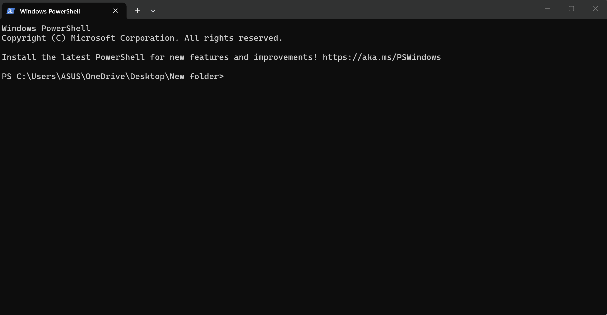

<div align="center">


# Jarvis AI Platform

### A Modular, Local-First, Open-Source AI Assistant Platform

Built with **Java 21**, **Spring Boot 4**, and **Spring AI 2.0**


</div>
---

<p align="center">
  
</p>

---
<p align="center">
  
</p>

---

# 🚀 What Is Jarvis?

Jarvis is not just a chatbot.

It is a **modular AI orchestration platform** that runs entirely on your own machine with complete privacy.

> **Your AI. Your Data. Your Machine.**

## Key Differences from ChatGPT

* Your conversations **never leave your computer**
* Completely **free** (runs on Ollama locally)
* **Remembers you** across sessions (Phase 2 ✅)
* **Searches your documents** (Phase 3 ✅)
* **Uses real-world tools** (Phase 4 ✅)
* **Speaks and listens** (Phase 5 — Coming Soon)

---

## 📈 Current Status

| Phase   | Version | Feature              | Status            |
| ------- | ------- | -------------------- | ----------------- |
| Phase 1 | v0.1.0  | AI Chat + CLI + JWT  | ✅ Released        |
| Phase 2 | v0.2.0  | Memory System        | ✅ Core Complete   |
| Phase 3 | v0.3.0  | RAG Engine           | ✅ Core Complete   |
| Phase 4 | v0.4.0  | Tool Engine          | ✅ Core Complete   |
| Phase 5 | v0.5.0  | Voice Assistant      | ✅ Core Complete   |
| Phase 6 | v0.6.0  | Agent System         | 📋 Next           |
| Phase 7 | v1.0.0  | Web UI               | 📋 Planned        |

---

# ✅ What Works Right Now

| Feature                           | Status | Since  |
| --------------------------------- | ------ | ------ |
| AI chat via CLI (streaming)       | ✅      | v0.1.0 |
| JWT authentication (Argon2id)     | ✅      | v0.1.0 |
| Session management + persistence  | ✅      | v0.1.0 |
| PostgreSQL (all messages saved)   | ✅      | v0.1.0 |
| Ollama local AI (primary)         | ✅      | v0.1.0 |
| Gemini cloud AI (fallback)        | ✅      | v0.1.0 |
| Provider abstraction              | ✅      | v0.1.0 |
| Redis session caching             | ✅      | v0.2.0 |
| Long-term memory storage          | ✅      | v0.2.0 |
| Automatic memory extraction       | ✅      | v0.2.0 |
| Memory injection into prompts     | ✅      | v0.2.0 |
| pgvector semantic memory search   | ✅      | v0.2.0 |
| Memory REST API                   | ✅      | v0.2.0 |
| Document upload + processing      | ✅      | v0.3.0 |
| Document chunking + embedding     | ✅      | v0.3.0 |
| RAG semantic search               | ✅      | v0.3.0 |
| RAG context injection into prompt | ✅      | v0.3.0 |
| DateTimeTool (timezone support)   | ✅      | v0.4.0 |
| CalculatorTool (exact math)       | ✅      | v0.4.0 |
| WeatherTool (OpenWeatherMap)      | ✅      | v0.4.0 |
| WebSearchTool (DuckDuckGo)        | ✅      | v0.4.0 |
| MCP Server (external clients)     | ✅      | v0.4.0 |
| CLI memory commands               | 📋     | v0.2.0 |
| Document REST API                 | 📋     | v0.3.0 |
| CLI document commands             | 📋     | v0.3.0 |
| Voice transcription (Whisper)     | ✅      | v0.5.0 |
| Text-to-speech (cross-platform)   | ✅      | v0.5.0 |
| Voice chat loop                   | ✅      | v0.5.0 |
| Voice selection + speed control   | ✅      | v0.5.0 |
| MCP Server (external clients)     | ✅      | v0.4.0 |

---

# ⚡ Quick Start

## Prerequisites

| Tool   | Version | Purpose            |
| ------ | ------- | ------------------ |
| Java   | 21+     | Runtime            |
| Docker | Latest  | PostgreSQL + Redis |
| Ollama | Latest  | Local AI Models    |

## Step 1 — Clone Repository

```bash
git clone https://github.com/sujankim/jarvis-ai-platform.git
cd jarvis-ai-platform
```

## Step 2 — Pull AI Models

```bash
# Chat model (~5GB)
ollama pull llama3.1:8b

# Embedding model (~274MB)
ollama pull nomic-embed-text
```

## Step 3 — Configure Environment

```bash
cp .env.example .env
```

Edit `.env`:

```env
JARVIS_JWT_SECRET=your-super-secret-key-at-least-32-characters

OPENWEATHER_API_KEY=your_openweather_key

GEMINI_API_KEY=your_gemini_key
```

## Step 4 — Start Infrastructure

```bash
docker-compose up -d
```

Starts:

* PostgreSQL 16 + pgvector
* Redis 7

## Step 5 — Run Jarvis

```bash
cd server
./mvnw spring-boot:run
```

## Step 6 — First-Time Setup

```text
jarvis:> setup
jarvis:> login
jarvis:> chat
```

---

# 💻 CLI Commands

## Authentication

```bash
login
logout
whoami
setup
```

## Chat

```bash
chat
chat --new
ask -m "Hello Jarvis"
```

## Sessions

```bash
session
new-session
switch-session -n 2
```

## Tools (Phase 4)

```bash
tools
tool-test --tool datetime
```

## System

```bash
status
doctor
jarvis-version
about
benchmark-latency --provider ollama --runs 10
```

---

# 🏗️ Architecture

```text
Spring Shell CLI (jarvis:> prompt)
           │
  Spring Boot 4 AI Engine
           │
  ┌────────┴────────────────────┐
  │                             │
AiOrchestrator            Memory System
                          (Phase 2 ✅)
  │
PromptAssembler
  │
  ├── Working Memory
  ├── Long-term Memories (pgvector)
  ├── RAG Context (pgvector)
  └── Session History (Redis)
           │
    ProviderRouter
    │             │
OllamaProvider  GeminiProvider
(local)         (cloud fallback)
    │
  Tools (Phase 4 ✅)
  ├── DateTimeTool
  ├── CalculatorTool
  ├── WeatherTool
  └── WebSearchTool
    │
MCP Server → External Clients
           │
PostgreSQL + pgvector     Redis
```

---

# 🛠️ Tech Stack

| Layer           | Technology          |
| --------------- | ------------------- |
| Language        | Java 21 (LTS)       |
| Framework       | Spring Boot 4.0.6   |
| AI Framework    | Spring AI 2.0.0-M8  |
| Web             | Spring WebFlux      |
| Security        | Spring Security 7   |
| Authentication  | JWT (Argon2id)      |
| Database        | PostgreSQL 16       |
| Vector Database | pgvector 0.7.4      |
| Data Access     | R2DBC + JDBC        |
| Cache           | Redis 7             |
| Migrations      | Flyway (V1–V14)     |
| Local AI        | Ollama              |
| Chat Model      | llama3.1:8b         |
| Embeddings      | nomic-embed-text    |
| Cloud AI        | Google Gemini       |
| Tools Protocol  | MCP (Spring AI)     |
| CLI             | Spring Shell 4      |
| Mapping         | MapStruct 1.6       |
| API Docs        | SpringDoc OpenAPI 3 |

---

# 🤝 Contributing

We welcome all contributions.

## Good First Issues

| Issue   | Description            | Phase   |
| ------- | ---------------------- | ------- |
| #3      | Token count display    | Phase 1 |
| #4      | Examples command       | Phase 1 |
| #6      | Docker image           | Phase 1 |
| #34     | CLI memory commands    | Phase 2 |
| Phase 3 | Document REST API      | Phase 3 |
| Phase 3 | PDF text extraction    | Phase 3 |
| Phase 4 | CLI tool commands      | Phase 4 |
| Phase 4 | Tool integration tests | Phase 4 |

See [CONTRIBUTING.md](CONTRIBUTING.md) for the setup guide.

---

# 📝 Articles

* [Building a Local-First AI Assistant with Spring Boot 4 — Dev.to](https://dev.to/sujankim/building-a-local-first-ai-assistant-with-spring-boot-4-and-spring-ai-20-6ci)
* [Jarvis AI Platform: Building Long-Term Memory with pgvector — Medium](https://medium.com/@sujan.lamichhane32/jarvis-ai-platform-building-long-term-memory-with-pgvector-and-spring-ai-c114b79dceda)
* [Jarvis AI Platform: Implementing Semantic Memory Retrieval with pgvector - Dev.to](https://dev.to/sujankim/jarvis-ai-platform-implementing-semantic-memory-retrieval-with-pgvector-30a1)

---

# 🔒 Privacy

* No telemetry by default
* Ollama runs 100% locally
* Conversations never leave your machine
* All embeddings stored locally in PostgreSQL
* MCP Server runs locally — no cloud dependency

---

# 📄 License

Licensed under the Apache License 2.0.

See [LICENSE](LICENSE) for details.

---

<div align="center">

Built by Sujan and the Open Source Community ❤️

⭐ Star this repository if Jarvis helps you!

</div>
